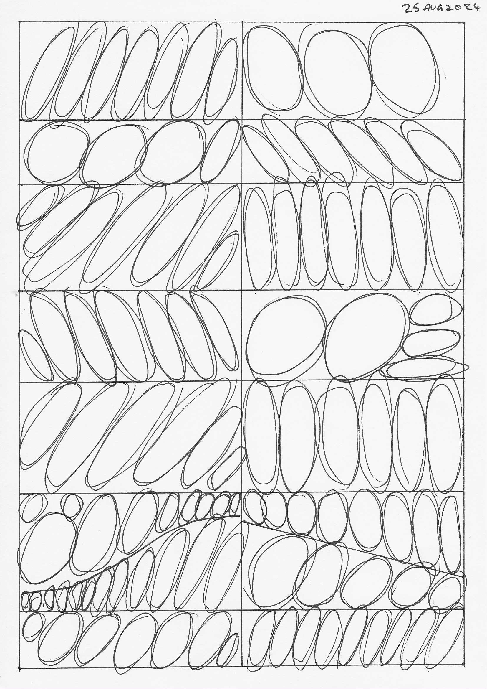

# Lesson 1

[Lesson 1](https://drawabox.com/lesson/1) breaks down into 3 parts:

## Lines

1. [Superimposed lines](https://drawabox.com/lesson/1/superimposedlines)

    
   [download](lines-1.jpg)

   
   [download](lines2.jpg)

1. [Ghosted lines](https://drawabox.com/lesson/1/ghostedlines)

    
    [download](ghosting.jpg)

1. [Ghosted planes](https://drawabox.com/lesson/1/ghostedplanes) : The pictures includes ellipses but these were not part of this exercise

   
   [download](ellipses-in-planes1.jpg)
   
   [download](ellipses-in-planes2.jpg)

## Ellipses

1. [Tables of ellipses](https://drawabox.com/lesson/1/tablesofellipses)

   
   [download](ellipses-grid1.jpg)
   
   
   [download](ellipses-grid2.jpg)

1. [Ellipses in planes](https://drawabox.com/lesson/1/ellipsesinplanes)

   
   [download](ellipses-grid1.jpg)
   
   [download](ellipses-in-planes2.jpg)

1. [Funnels](https://drawabox.com/lesson/1/funnels)

   
   [download](funnels.jpg)

## Boxes

1. [Plotted perspective](https://drawabox.com/lesson/1/plottedperspective)

   
   [download](plotted-perspective.jpg)

1. [Rough perspective](https://drawabox.com/lesson/1/roughperspective)

   
   [download](rough-perspective-1.jpg)
   
   [download](rough-perspective-2.jpg)
  
1. [Rotated boxes](https://drawabox.com/lesson/1/rotatedboxes "Rotated boxes")

  
  [download](rotated-perspective.jpg)